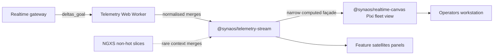

# Synaos Real-time Operations Dashboard — Scaling Design

Design document for taking the existing platform from ~60 to ~300 robots on one shopfloor, three new vehicle types, and a second control-room workstation elsewhere, inside ~five months across five multidisciplinary product teams. Angular monorepo, Module Federation micro-frontends, shared design system, NGXS today, shopfloor WebGL map at ~30–37 FPS under current full load.

### Stated assumptions

1. **Per-robot telemetry cadence is roughly 5–10 Hz ⇒ ~3k envelopes/sec worst case with 300 robots.** _If materially higher_: earlier backpressure/binary encoding decisions spike in urgency in Phase 0.
2. **Backend-owning teammates can converge, via working group consensus, on a better websocket contract (deltas; viewport-awareness when achievable) within five months.** _If not_: Worker-side snapshot diffing buys UI-thread calm but leaves bandwidth pain — acceptance risk persists.
3. **Modern Chromium plus integrated-or-better GPU is a contractual deployment baseline for workstations running the dashboard; we do not build legacy fallbacks.** _If breached_: contractual / facilities escalation, not a quiet engineering carve-out.
4. **Industrial design produces GLB/textures for new vehicle archetypes roughly by Phase-rehearsal window.** _If late_: fleet 2D unaffected; lazy 3D remote slips visually.

## 1. Stakeholders and personas

### External (people using or signing)

- **Control-room operator (remote building).** Wall overview; maximal density tolerance; jitter and stalled alarms undermine trust fastest. Their canonical heavy client is distinct hardware from adjacent supervisor desks—not two maps duelling on one GPU.
- **Floor supervisor.** Richer contextual drilldown on smaller subsets of robots matters more than total fleet pixel density.
- **OEM purchaser / acceptance audience.** Acceptance criteria remain **behaviour seen under load**: sustained smooth motion at nominal scale plus **authorised second workstation** behaving identically—not architecture slide decks.

### Internal (builders / approvers)

- **Five multidisciplinary product teams** — FE _and_ BE ownership both slice across them; aligning contracts is symmetrical work to aligning canvas integrations.
- **Engineering leadership** — funds borrowed platform capacity plus blesses escalation paths (RFC, perf budgets).

### Conflicting pressures

| Tension                                                | How we adjudicate briefly                                                         |
| ------------------------------------------------------ | --------------------------------------------------------------------------------- |
| Operator density vs. supervisor ornamentation          | Density / LOD modes — never one global ornate style.                              |
| Product roadmap throughput vs. platform spine          | Transparent temporary haircut borrowed capacity funds.                            |
| Autonomous squad backends vs. unified pipe             | Working group negotiation **with** escalation hooks — not unmanaged local optima. |
| OEM-visible flashy vs. foundational plumbing invisible | Tie invisible work explicitly to Sections 5 & rehearsal metrics.                  |

### Priority consequence at milestone

Operators plus OEM-visible acceptance outweigh supervisor ornament **if calendar forces choice** — roadmap messaging must say so upfront.

## 2. Technical assessment — three core risks

### R1 — The fleet map may not stay smooth at ~300 robots

Cost does not rise gently with headcount: how we draw, allocate memory, and animate all stacks up. **Profile before a big rewrite**; Phase 2 money goes to **`@synaos/realtime-canvas`** only once we know where time is spent.

**Mitigations:** Phase 0 profiling; batched sprites / instancing where it helps; simpler visuals when zoomed out (LOD by zoom); interpolate between position ticks so motion stays calm.

### R2 — Clicks and scrolling can lag from state churn on the main thread

Shipping every robot update through NGXS can clog that thread long before the fleet canvas becomes the bottleneck. Heavy ingest and merge should live **off** that path, with a small stable view model feeding the map (Section 3).

**Mitigations:** **`@synaos/telemetry-stream`** Web Worker plus NgRx Signal Store façade that exposes only what the map and panels need.

### R3 — We still lack a shared picture of payload size and who watches from where

Without a signed rehearsal layout and a leaner realtime contract, teams **improvise**—duplicate tabs, mirrored subscriptions, huge JSON blobs. OEM acceptance frays in lots of small ways, not one missing branch.

**Mitigations:** Week-one written acceptance diagram (one heavy live map per workstation, control room on separate hardware); phased protocol work (deltas, viewport narrowing when backend can, recovery snapshots); Worker-side diffing as an honest interim if the wire stays fat.

## 3. Architectural approach

### 3.1 Data path overview

Unidirectional ideal:

1. **Gateway** trims & versions outbound traffic (preferred: deltas; progressive viewport scoping cooperative with BE capacity).
2. **`@synaos/telemetry-stream` worker** parses & normalises cheaply away from Angular’s interaction thread.
3. **NgRx Signal Store façade** merges entity truth with **equality-guarded** patch paths — logical no-ops avoided before signals propagate broadly.
4. **`@synaos/realtime-canvas` (Pixi baseline)** listens to façade-computed narrowly scoped signals (viewport entity bucket, alarms, explicit selection pointer) + performs interpolation tiers for motion continuity.
5. **NGXS** retains slower tenant / preference facets feeding façade rarely — not heartbeat dispatch amplification.

_[NgRx Signal Store guide](https://ngrx.io/guide/signals/signal-store)_

### 3.2 Comparative renderer choice (fleet 2D)

Two credible 2D stacks stand out for a dense, realtime map. **Pixi.js** centres on sprites, batching, and straightforward level-of-detail: it fits a factory-floor map where robots are markers or small icons moving at high frequency **without** tying the product to a full geospatial map stack—we treat it as the **default baseline** behind `@synaos/realtime-canvas`. **deck.gl** is stronger when map data is inherently geospatial and large tiling, layers, and deck’s pipeline are already a platform anchor; for this scenario it is mostly **avoided as default** unless product direction later demands heavy geo overlays, in which case the trade-off becomes worth reopening.

**Constraint:** no Three.js on multi-robot fleet canvas—2D only at fleet scale; 3D stays in the lazily loaded single-robot remote.

### 3.3 Interaction with backend collaborators

Prefer incremental protocol slices (version tagging, causal ordering cues, compaction for lagging watchers, authoritative resync bursts). Pursue concise binary wire encodings **only** after traced CPU proof JSON dominates.

### 3.4 Telemetry package responsibilities (`@synaos/telemetry-stream`)

Owns websocket session lifecycle bridging into worker, merges entity maps, fronts NgRx Signal Store updaters guarded by pragmatic equality predicates, emits minimal computed façades outward for map + ancillary widgets.

Fallback if schedule compresses painfully: mechanically identical Injectable+signal scaffolding while preserving outward API contract—Signal Store absorbs later without consumer churn.

### 3.5 Optional lazily-loaded 3D remote

User gesture opens federated **`vehicle-detail-3d`**: simultaneous fetch of chunked remote JS (Three bundles) plus CDN model assets until placeholder shell from design-system panels yields to textured scene tying into shared façade selectors.

### 3.6 Federation & delivery hygiene

Maintain existing Module Federation remote boundaries (no mid-programme replatform of federation topology). Publish shared NPM workspaces above. Operational checklist coordinates semver / deploy choreography shell↔remote when canvases ripple — organisational hygiene, previously treated as tertiary risk consciously demoted beneath R1–R3.

### 3.7 Intentionally _not_ replatformed now

- Wholesale NGXS disappearance
- Redrawing federation graph wholesale
- Multi-robot live 3D theatre (explicitly postponed)

### 3.8 Reference diagram

## 4. Delivery & organisational strategy (≈20 weeks)

| Phase | Window | Objective                                                                                                                   |
| ----- | ------ | --------------------------------------------------------------------------------------------------------------------------- |
| **0** | W1–2   | Instrument + publish signed acceptance footprint + traffic capture hypotheses                                               |
| **1** | W3–6   | Versioned ingest path + façade behind flag + **first negotiated contract slices**                                           |
| **2** | W7–11  | `@synaos/realtime-canvas` shadow/canary rollout then progressive cut-over                                                   |
| **3** | W12–15 | Second sanctioned machine flows + tenancy/auth hardening (one-map-per-workstation / duplicate-subscription regression hunt) |
| **4** | W16–18 | Customer-scale rehearsals + fleet visual variants + lazy 3D remote when assets ripe                                         |
| **5** | W19–20 | Harden / freeze / playbook / escalation                                                                                     |

### Influencing mechanics (no-line-authority realism)

**Real-time platform council** — each shipping squad designates a standing engineer + rotates backend delegate when payloads discussed; Staff FE facilitates; RFC-lite backlog for façade + schema edges.

**Numeric perf thresholds** surfaced in CI for shared artefacts (frame regressions envelope, ingest→present tail markers, websocket volume budgets).

### Leadership requests

Borrow ~**three** engineers at **½–¾** concurrent focus **plus Staff** for five calendar months → explicit carve-out from roadmap promises—not implicit heroics. Afterwards either dissolve consciously or elevate formal platform mandate.

Messaging to PM partners: transient velocity dip consciously purchases **singular** rehearsal reliability vs. probabilistic multiplicity of canvases diverging dangerously.

## 5. Trade-offs & business framing

Three engineering choices merit executive translation—operators feel them, purchasers rehearse against them, roadmaps bleed for them briefly.

### 5.1 Smaller, sharper realtime payloads (ideal: deltas + progressive viewport narrowing)

**Improves** sustainable operator truth + OEM zoom exercises + cheaper reconnect behaviours.

**Costs** disciplined multi-team schema negotiation—not a covert weekend patch.

**If deferred** Acceptance brittleness; Worker smoothing ≠ bandwidth cure → commercial hinge risk concentrates.

### 5.2 One fleet renderer package `@synaos/realtime-canvas`

**Improves** unified tuning for density/LOD/smoothing—fewer stochastic perf cliffs.

**Costs** deliberate CODEOWNERS / RFC drag on narrowly local flashy ideas.

**If deferred** Divergent canvases → inconsistent rehearsal arcs → politically expensive late unify.

### 5.3 Borrowed platform bandwidth + councils + thresholds

**Improves** calendar honesty—work visible, measured, debated with data signals.

**Costs** Borrowed fractional heads + verbal leadership defence of purposeful roadmap sacrifice.

**If deferred** Implicit integration debt avalanche into final rehearsals before contractual demo.

### 5.4 One sentence for leadership

Invest simultaneously in pipe shape **and** shared canvas mechanics **and** temporary funded alignment—or risk paying all three costs later under OEM spotlight.

## 6. Open questions & earliest validations

Check during **Phase 0** (cheap if early, expensive if late):

1. Profiler-first dominant bottleneck attribution (GPU vs worker vs Angular main-thread budget).
2. Captured websocket size / frequency empirical histograms—not assumed.
3. Written OEM rehearsal script, signed off, aligning accepted machine choreography (one heavy map per PC, control-room on separate hardware).
4. Gateway squads **appetite** scorecard for deltas / viewport narrowing vs. phased compromise path.
5. Industrial model pipeline checkpoints for lazily-loaded 3D remote.
6. Contractual workstation hardware attestation on file (per assumption 3 above).
7. Early Signal Store façade spike: NGXS chatter reduction vs façade-only map subscription experiment.

## Appendix — suggestion for a 60-minute defence walkthrough (~20 minutes content)

| Minutes | Focus                                         |
| ------: | --------------------------------------------- |
|       2 | Opening assumptions + rationale               |
|       4 | Persons + conflict table → binding priorities |
|       5 | Risks R1–R3 (plain language emphasis on R3)   |
|       6 | Diagram + façade / canvas packages            |
|       3 | Timeline + borrowing / council                |
|      ~2 | Trade-off recap: Section 5.1–5.4 headlines    |

Prepared pivots: timeline halved aggressively; hypothetical OEM demands multi-robot live 3D; backend alignment stalls sharply; leadership declines borrowed platform capacity—each maps to phased fallback already documented (Worker diffing, postpone 3D scope, escalate contractually, lengthen risk span respectively).
