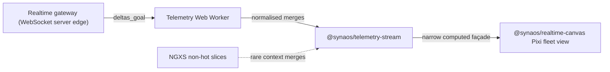

# Synaos Real-time Operations Dashboard — Scaling Design

Design document for taking the existing platform from ~60 to ~300 robots on one shopfloor, three new vehicle types, and a second control-room workstation elsewhere, inside ~five months across five multidisciplinary product teams. Angular monorepo, Module Federation micro-frontends, shared design system, NGXS today, shopfloor WebGL map at ~30–37 FPS under current full load.

### Stated assumptions

1. **Per-robot telemetry cadence is roughly 5–10 Hz ⇒ ~3k envelopes/sec worst case with 300 robots.** _If materially higher_: earlier backpressure/binary encoding decisions spike in urgency in Phase 0.
2. **Backend-owning teammates can converge, via working group consensus, on a better websocket contract (deltas; viewport-awareness when achievable) within five months.** _If not_: Worker-side snapshot diffing buys UI-thread calm but leaves bandwidth pain — acceptance risk persists.
3. **Modern Chromium plus integrated-or-better GPU is a contractual deployment baseline for workstations running the dashboard; we do not build legacy fallbacks.** _If breached_: contractual / facilities escalation, not a quiet engineering carve-out.
4. **Industrial design produces GLB/textures for new vehicle archetypes roughly by Phase-rehearsal window.** _If late_: fleet 2D unaffected; lazy 3D remote slips visually.

## 1. Stakeholders and personas

### External (people using or signing)

- **Control-room operator (remote building).** Wall overview; maximal density tolerance; jitter and stalled alarms undermine trust fastest. Their canonical heavy client is distinct hardware from adjacent supervisor desks—not two maps duelling on one GPU.
- **Floor supervisor.** Richer contextual drilldown on smaller subsets of robots matters more than total fleet pixel density.
- **OEM purchaser / acceptance audience.** Acceptance criteria remain **behaviour seen under load**: sustained smooth motion at nominal scale plus **authorised second workstation** behaving identically—not architecture slide decks.

### Internal (builders / approvers)

- **Five multidisciplinary product teams** — FE _and_ BE ownership both slice across them; aligning contracts is symmetrical work to aligning canvas integrations.
- **Engineering leadership** — funds borrowed platform capacity plus blesses escalation paths (RFC, perf budgets).

### Conflicting pressures

| Tension                                                | How we adjudicate briefly                                                         |
| ------------------------------------------------------ | --------------------------------------------------------------------------------- |
| Operator density vs. supervisor ornamentation          | Density / **LOD (level of detail)** modes — never one global ornate style.                              |
| Product roadmap throughput vs. platform spine          | Transparent temporary haircut borrowed capacity funds.                            |
| Autonomous squad backends vs. unified pipe             | Working group negotiation **with** escalation hooks — not unmanaged local optima. |
| OEM-visible flashy vs. foundational plumbing invisible | Tie invisible work explicitly to Sections 5 & rehearsal metrics.                  |

### Priority consequence at milestone

Operators plus OEM-visible acceptance outweigh supervisor ornament **if calendar forces choice** — roadmap messaging must say so upfront.

## 2. Technical assessment — three core risks

### R1 — The fleet map may not stay smooth at ~300 robots

Cost does not rise gently with headcount: how we draw, allocate memory, and animate all stacks up. **Profile before a big rewrite**; invest hard in **`@synaos/realtime-canvas`** rollout (**Section 4**, Phase **3**) only after Phase **2** has compared the two control-room setups and shown where the frame budget and wire time really go.

**Mitigations:** Phase 0 profiling; batched sprites / instancing where it helps; simpler visuals when zoomed out (LOD by zoom); interpolate between position ticks so motion stays calm.

### R2 — Clicks and scrolling can lag from state churn on the main thread

Shipping every robot update through NGXS can clog that thread long before the fleet canvas becomes the bottleneck. Heavy ingest and merge should live **off** that path, with a small stable view model feeding consumers of the realtime façade (Section 3).

**Mitigations:** **`@synaos/telemetry-stream`** Web Worker plus NgRx Signal Store façade that exposes only narrow **computed** outputs the hot path needs.

### R3 — We still lack a shared picture of payload size and who watches from where

Without a signed rehearsal layout and a leaner realtime contract, teams **improvise**—duplicate tabs, mirrored subscriptions, huge JSON blobs. OEM acceptance frays in lots of small ways, not one missing branch.

**Mitigations:** Week-one written acceptance diagram (one heavy live map per workstation, control room on separate hardware); phased protocol work (deltas, viewport narrowing when backend can, recovery snapshots); Worker-side diffing as an honest interim if the wire stays fat.

## 3. Architectural approach

The fleet path is one **left-to-right data pipeline** (realtime gateway → worker → **`@synaos/telemetry-stream`** → **`@synaos/realtime-canvas`**). **Transport:** the dashboard opens a **WebSocket** to the backend; **`realtime gateway` means that backend edge**—the tier that terminates the socket, shapes messages (deltas, subscriptions), and reconnect semantics—not the browser itself. The subsections below walk **each node in that order**; the **reference diagram at the end** gathers the same shapes for orientation.

### 3.1 Walking the pipeline (each box, in diagram order)

1. **Realtime gateway (backend WebSocket edge)** — The service layer clients actually talk to over **WebSocket** (today’s baseline in the scenario). It **versions** and **shapes** outbound traffic: **deltas** first; **viewport-narrow** subscriptions when backend squads converge. Responsibilities extend to sequencing, compaction for slow clients, authoritative **resync** after gaps, and—only if profiling proves it—**binary** payloads instead of assuming JSON is the choke. *(Other realtime transports later could sit behind the same logical role; WebSocket remains the contractual path for this programme.)*

2. **Telemetry Web Worker** — Parses and normalises **off** the Angular main thread so interaction and layout keep their frame budget during bursts.

3. **`@synaos/telemetry-stream`** — Owns **the browser side** of the connection: websocket client session, hand-off to Worker, merged entity map, **NgRx Signal Store** as the realtime façade ([Signal Store guide](https://ngrx.io/guide/signals/signal-store)), **equality-guarded** updates so no-op logical states do not ripple consumers, and **narrow `computed` outputs** (viewport slice, alarms, selection, …). **Signals memoize behaviour:** writable signals and `computed` only propagate when the new value is **unequal** to the previous one (by default, **referential equality** for objects)—so downstream subscribers skip work when nothing changed; we still apply **explicit per-robot merge predicates** before writing so we do not rebuild object graphs every tick anyway. **Single-robot 3D** is **not** drawn on the diagram: drill-in loads a **lazy Module Federation** remote (Three.js + CDN `.glb`) that still **reads the same façade** for the selected entity—no second WebSocket or duplicate fleet ingest; it is omitted here so the figure stays about **bulk telemetry → fleet canvas** only. If schedule compresses, ship the **same outward API** via `Injectable` + `signal()` first; swap in Signal Store without touching map consumers.

4. **NGXS (non-hot slices)** — Session, tenancy, slower preferences. **Rare**, explicit merges into the realtime façade—never a per-tick motorway into the fleet map.

5. **`@synaos/realtime-canvas`** — Reads only façade-driven signals. Default **Pixi.js** (batched sprites, zoom **LOD**). **Interpolation runs in the render loop** between sparse telemetry ticks. The **fleet map stays 2D-only**; Three.js lives in the lazy single-robot remote described in (3). **deck.gl** only if the product later **centres** on heavy geo tiling.

### 3.2 Reference diagram (clarifying summary)

## 4. Delivery & organisational strategy (~20 weeks)

Roughly **five months** (~**20 weeks**): **ten two-week sprints** in a row. The phases below are **only full 2-week sprints** — no half-week or “spillover” buckets — so planning, capacity, and demos stay on a normal sprint cadence.

| Phase | Weeks (sprints) | What we deliver — in product terms                                                                 |
| ----- | --------------- | -------------------------------------------------------------------------------------------------- |
| **0** | **W1–2** — 2 weeks — **1** sprint | **Analyse how things work today**, not guess: the **websocket / live-data layer** (who owns what, message shape, reconnect behaviour) **and** the **frontend infrastructure as it sits** — Angular monorepo layout, micro-frontend boundaries, shared libraries, how NGXS meets the live map, build and deploy flow — so later phases rest on facts. **Agree how we will prove success** before go-live (which rooms, which machines, what “good” looks like). **Turn on basic measurement** so we know where time and data are actually spent. **Record real live traffic** from the websocket so we plan from evidence, not assumptions. |
| **1** | **W3–6** — 4 weeks — **2** sprints | **Ship a safer new path for live robot data** behind a feature flag — users see the same app, but the plumbing that will scale is in place. **Reach a written agreement with backend teams** on how the realtime contract will evolve, anchored on **deltas** and **viewports** (what changes are sent, and which slice of the floor each client subscribes to as the view moves). |
| **2** | **W7–10** — 4 weeks — **2** sprints | **Stand up the second control-room setup** next to the existing one and **run them in parallel** so we can **compare** behaviour and load under the same programme goals — not a throwaway lab, but two real environments. **Identify performance bottlenecks** with the traces we already turned on (GPU, main thread, worker, bytes on the wire). Use that evidence to decide whether **JSON** on the websocket is still good enough or **binary** payloads earn their complexity — we only commit to binary if measurement shows the feed is the real limit, not something cheaper to fix first. |
| **3** | **W11–14** — 4 weeks — **2** sprints | **Roll out the shared fleet map package carefully**: run it next to the old map, then **switch over in steps** so the shopfloor never gets a risky “big switch” day. **Tighten login and customer boundaries** where the two-site story needs it. **Track down “double subscriptions”** and other foot-guns that waste bandwidth or confuse operators across both setups. |
| **4** | **W15–18** — 4 weeks — **2** sprints | **Rehearse at full customer scale** with everyone in the room. **Polish how the three new vehicle types look** on the map. **Turn on optional 3D drill-in** when the 3D assets are actually ready — not before. |
| **5** | **W19–20** — 2 weeks — **1** sprint | **Stop adding scope**, **freeze what “done” means** for go-live, write the **runbook and escalation path** for when things wobble, and **last hardening** before handover. |

### How we steer without “owning” any team — and what to ask bosses for

**Lightweight rhythm:** Fixed contact from each squad for realtime topics; backend joins when the wire contract is on the table. Staff FE facilitates and keeps one short rolling list of agreements (payloads, shared packages).

**Cheap automated checks** on shared code—frames, lag from message to screen, websocket load—so slips show up before big reviews.

**What leadership funds:** **Borrow** roughly **three** engineers at **about half–three-quarters of their usual squad capacity**, **plus Staff FE**, for **almost the whole programme** — as **planned roadmap pauses**, not unpaid heroics. They convene as a **coordination-focused working group**, **not** a spun-out engineering team: each person **stays in their squad**, keeps **those squads in the loop**, and aligns what the working group commits to with **home squad** sprint plans. If the groove sticks after go-live prep, elevate the same posture into an explicit **platform working group**; otherwise wind it down on purpose.

**For PMs:** A **stretch of quieter delivery on neighbouring roadmap rows** buys **one shared, rehearsed experience** OEM and operators can jointly stand behind—not five drifting maps.

## 5. Trade-offs & business framing

Three engineering choices merit executive translation—operators feel them, purchasers rehearse against them, roadmaps bleed for them briefly.

### 5.1 Smaller, sharper realtime payloads (ideal: deltas + progressive viewport narrowing)

**Improves** sustainable operator truth + OEM zoom exercises + cheaper reconnect behaviours.

**Costs** disciplined multi-team schema negotiation—not a covert weekend patch.

**If deferred** Acceptance brittleness; Worker smoothing ≠ bandwidth cure → commercial hinge risk concentrates.

### 5.2 One fleet renderer package `@synaos/realtime-canvas`

**Improves** unified tuning for density/LOD/smoothing—fewer stochastic perf cliffs.

**Costs** deliberate CODEOWNERS / RFC drag on narrowly local flashy ideas.

**If deferred** Divergent canvases → inconsistent rehearsal arcs → politically expensive late unify.

### 5.3 Borrowed squad capacity for a working group + lightweight forums + CI guardrails

**Improves** calendar honesty—work visible, measured, debated with data signals.

**Costs** Fractional time from home squads feeding a **coordination working group** (not a standalone team) + leadership visibly backing purposeful roadmap sacrifice.

**If deferred** Implicit integration debt avalanche into final rehearsals before contractual demo.

### 5.4 One sentence for leadership

Invest simultaneously in pipe shape **and** shared canvas mechanics **and** temporary funded alignment—or risk paying all three costs later under OEM spotlight.
